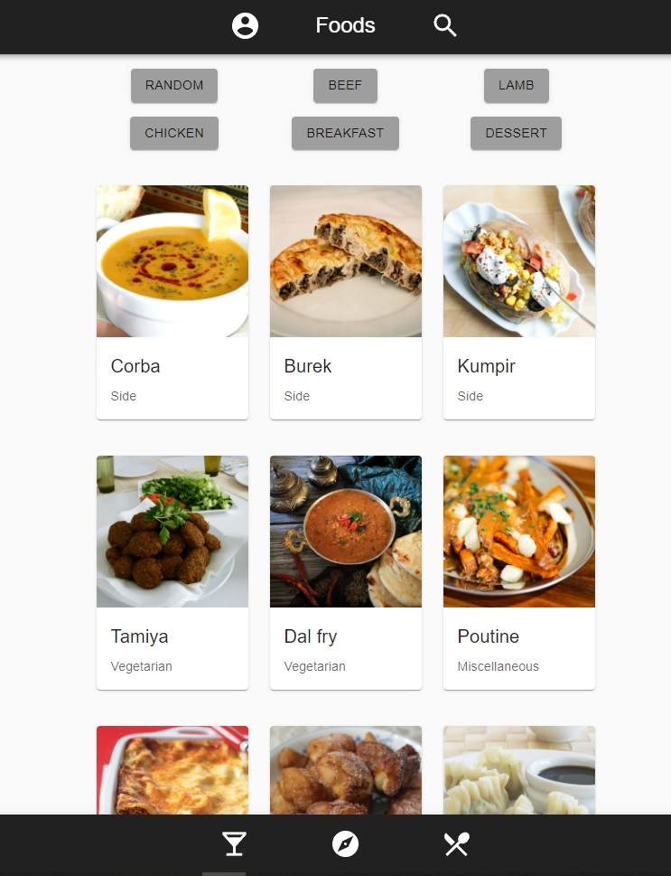
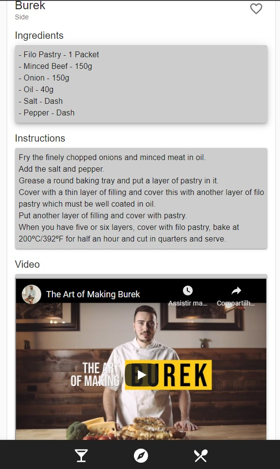
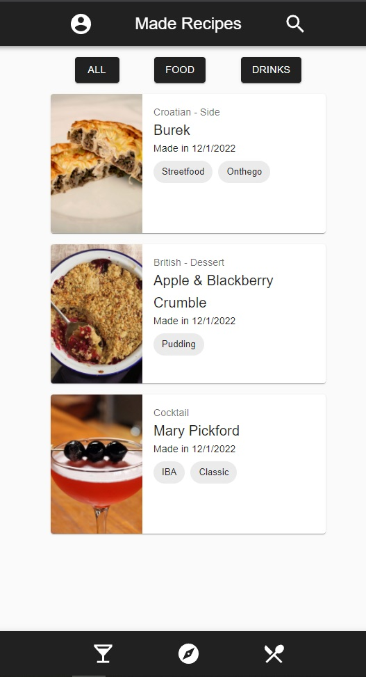

# Recipes App
Front-end webApp built with ReactJS using React-Query and ContextApi for state management.
- Fully responsive layout using Material-UI component library.
- Recipes are grabbed from the [MealDB](https://www.themealdb.com/) and the [CocktailsDB](https://www.thecocktaildb.com/) external APIs. 
- Users can search/filter recipes and add to favorites.

## Live Demo
[Recipes App Live Demo](https://matheuspor.github.io/recipes-app/).

## Main Page

## Recipe Page

## Made Recipes

